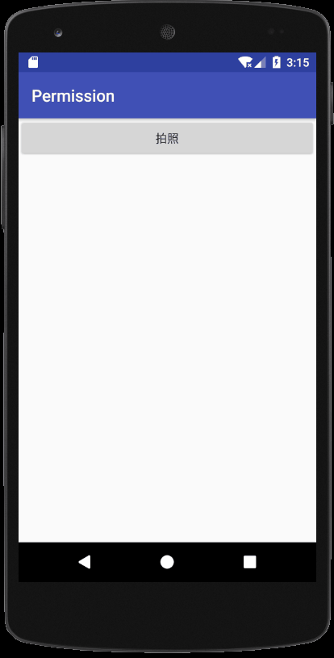
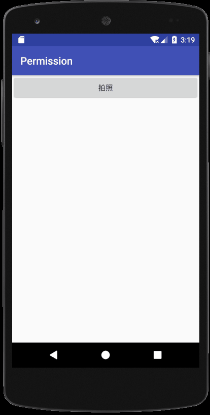
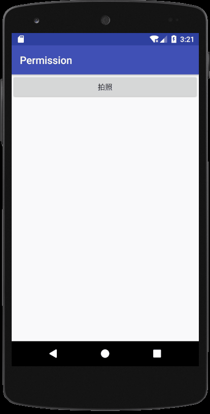
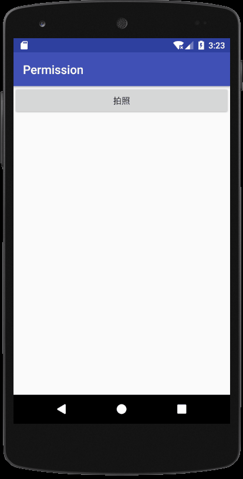

[GitHub](https://github.com/AnJiaoDe/Permission)

[APK](https://github.com/AnJiaoDe/Permission/blob/master/app/build/outputs/apk/app-debug.apk)

将libray模块复制到项目中,或者直接在build.gradle中依赖:

```
allprojects {
		repositories {
			
			maven { url 'https://jitpack.io' }
		}
	}
```

```
dependencies {
	              compile 'com.github.AnJiaoDe:Permission:V1.0.0'


	}
```
**注意：如果sync报错，是因为和com.android.tools.build:gradle 3.0有关，**
**可以改将compile改为implementation 或者api** 


Android 6.0以上，危险权限必须经过动态请求，危险权限分组图


## 1.全部允许




## 2.拒绝



## 3.拒绝



## 4.用户拒绝并且选中了不再询问，弹窗让用户去授权



## 5.用户同意了授权，闲的难受去关闭了授权


使用方法:

```
public class MainActivity extends PermissionActivity {

    @Override
    protected void onCreate(Bundle savedInstanceState) {
        super.onCreate(savedInstanceState);
        setContentView(R.layout.activity_main);

        findViewById(R.id.btn).setOnClickListener(new View.OnClickListener() {
            @Override
            public void onClick(View v) {
                checkPermissionCAMERA(new OnPermissionRequestListener() {
                    @Override
                    public void onPermissionHave() {
                        showToast("用户同意了相机权限");

                        checkPermissionWRITE_EXTERNAL_STORAGE(new OnPermissionRequestListener() {
                            @Override
                            public void onPermissionHave() {
                                showToast("用户同意了存储权限,可以执行拍照操作了");

                            }

                            @Override
                            public void onPermissionRefuse() {
                                showToast("用户拒绝了存储权限");

                            }

                            @Override
                            public void onPermissionRefuseNoAsk() {
                                showToast("用户拒绝了存储权限并且选中了不再询问");

                            }
                        });
                    }

                    @Override
                    public void onPermissionRefuse() {
                        showToast("用户拒绝了相机权限");

                    }

                    @Override
                    public void onPermissionRefuseNoAsk() {
                        showToast("用户拒绝了相机权限并且选中了不再询问");

                    }
                });
            }
        });

       //或者
//        checkPermission(new String[]{Manifest.permission.WRITE_EXTERNAL_STORAGE},
//                "存储权限已被禁用","拍照功能必须打开存储权限，否则无法使用", new OnPermissionRequestListener() {
//
//                    @Override
//                    public void onPermissionHave() {
//
//                        showToast("用户同意了存储权限");
//
//
//                    }
//
//                    @Override
//                    public void onPermissionRefuse() {
//                        showToast("用户拒绝了存储权限");
//
//                    }
//
//                    @Override
//                    public void onPermissionRefuseNoAsk() {
//                        showToast("用户拒绝了存储权限并且选中了不再询问");
//
//                    }
//                });
    }

    @Override
    public void onClick(View v) {

    }
}

```
源码：

```
public abstract class PermissionActivity extends AppCompatActivity implements View.OnClickListener {
    private String toast_perm_refuse,dialog_perm_refuse_noask;
    private OnPermissionRequestListener onPermissionHaveListener;


    public <T extends View> T getViewByID(@IdRes int id) {
        return (T) findViewById(id);
    }


    //??????????????????????????????????????????????????????????????????????
    public String nullToString(Object object) {
        return object == null ? "" : object.toString();
    }


    //??????????????????????????????????????????????????????????????????????
    public void showToast(String msg) {
        Toast.makeText(this, msg, Toast.LENGTH_SHORT).show();
    }

    public void showToast(int string_id) {
        Toast.makeText(this, getResources().getString(string_id), Toast.LENGTH_SHORT).show();
    }


    public void startAppcompatActivity(Class<?> cls) {
        startActivity(new Intent(this, cls));
    }


    /*
            6.0权限检查存储权限
             */
    public void checkPermissionWRITE_EXTERNAL_STORAGE( OnPermissionRequestListener onPermissionHaveListener) {
        ActivityCompat.requestPermissions(this, new String[]{Manifest.permission.WRITE_EXTERNAL_STORAGE}, 1);
        this.toast_perm_refuse = "存储权限已被禁用";
        this.dialog_perm_refuse_noask="存储权限被禁用，您将无法使用相机、相册、图片下载等功能";

        this.onPermissionHaveListener = onPermissionHaveListener;

    }
    /*
            6.0权限检查相机权限
             */
    public void checkPermissionCAMERA( OnPermissionRequestListener onPermissionHaveListener) {
        ActivityCompat.requestPermissions(this, new String[]{Manifest.permission.CAMERA}, 1);
        this.toast_perm_refuse = "相机权限已被禁用";
        this.dialog_perm_refuse_noask="相机权限被禁用，您将无法使用相机进行拍照";

        this.onPermissionHaveListener = onPermissionHaveListener;

    }
    /*
            6.0权限检查
             */
    public void checkPermission(String[] permission, String toast_perm_refuse,String dialog_perm_refuse_noask, OnPermissionRequestListener onPermissionHaveListener) {
        ActivityCompat.requestPermissions(this, permission, 1);
        this.toast_perm_refuse = toast_perm_refuse;
        this.dialog_perm_refuse_noask=dialog_perm_refuse_noask;

        this.onPermissionHaveListener = onPermissionHaveListener;

    }


    @Override
    public void onRequestPermissionsResult(int requestCode, @NonNull String[] permissions, @NonNull int[] grantResults) {
        super.onRequestPermissionsResult(requestCode, permissions, grantResults);

        for (int i = 0; i < permissions.length; i++) {


            if (grantResults[i] == PackageManager.PERMISSION_GRANTED) {
                if (onPermissionHaveListener != null) {
                    onPermissionHaveListener.onPermissionHave();
                }
                continue;

            }

            if (grantResults[i] == PackageManager.PERMISSION_DENIED) {
                //在用户已经拒绝授权的情况下，如果shouldShowRequestPermissionRationale返回false则
                // 可以推断出用户选择了“不在提示”选项，在这种情况下需要引导用户至设置页手动授权
                if (!ActivityCompat.shouldShowRequestPermissionRationale(this, permissions[i])) {
                    if (onPermissionHaveListener != null) {
                        onPermissionHaveListener.onPermissionRefuseNoAsk();
                    }
                    //解释原因，并且引导用户至设置页手动授权
                    new AlertDialog.Builder(this)
                            .setMessage(dialog_perm_refuse_noask)
                            .setPositiveButton("去授权", new DialogInterface.OnClickListener() {
                                @Override
                                public void onClick(DialogInterface dialog, int which) {
                                    //引导用户至设置页手动授权
                                    Intent intent = new Intent(Settings.ACTION_APPLICATION_DETAILS_SETTINGS);
                                    Uri uri = Uri.fromParts("package", getApplicationContext().getPackageName(), null);
                                    intent.setData(uri);
                                    startActivity(intent);
                                }
                            })
                            .setNegativeButton("取消", new DialogInterface.OnClickListener() {
                                @Override
                                public void onClick(DialogInterface dialog, int which) {
                                    //引导用户手动授权，权限请求失败
                                }
                            }).show();

                } else {
                    //权限请求失败，但未选中“不再提示”选项
                    showToast(toast_perm_refuse);
                    if (onPermissionHaveListener != null) {
                        onPermissionHaveListener.onPermissionRefuse();
                    }
                }
                break;
            }

        }


    }

    public interface OnPermissionRequestListener {
        public void onPermissionHave();

        public void onPermissionRefuse();

        public void onPermissionRefuseNoAsk();
    }
}

```
[GitHub](https://github.com/AnJiaoDe)

关注专题[Android开发常用开源库](https://www.jianshu.com/c/3ff4b3951dc5)

[简书](https://www.jianshu.com/u/b8159d455c69)

 微信公众号
 

QQ群

